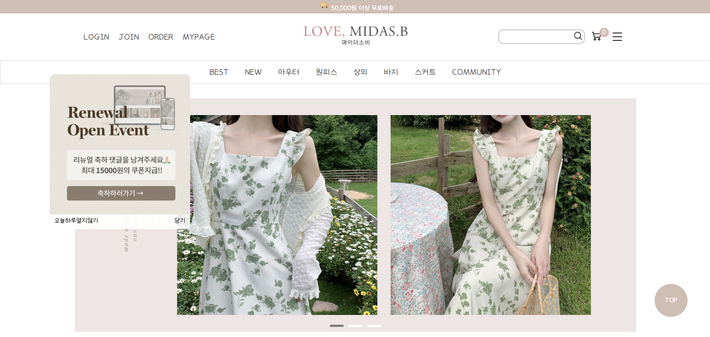

### 👻 포트폴리오 소개
- 주색: #d6bdb3
- 보조색: #ede6e4, #fff
- 벤치마킹 사이트 : http://www.midasb.co.kr/ 
		
### 👻 페이지 구성
- 메인페이지
  	
	- 스크롤 기능 (best item으로 가면 밑에 아이템 스르륵 올라온다.)
	- header nav에 호버시 판 나온다.
	- top_banner 2초마다 돌아간다.
	- 메인베너 자동으로 돌아가고  마우스 오른쪽에 있으면 >, 왼쪽에 있으면 < (클릭하면 다음 사진으로 넘어감)
	- 헤더에 햄버거 버튼 누르면 메뉴바 나옴
	- header에서 best나 new 누르면 해당 영역으로 이동 
	- best_item 부분 사진 호버시 사진 커지고 텍스트랑 하트 나오고 하트에 호버시 빨간색으로 바뀜
	- new_item 부분 사진 호버시 사진 바뀜, more 버튼 누르면 item 8개씩 나옴
	- best_review 부분 사진 호버시 돌아가고 텍스트 보이게 
	- top_button 누르면 top으로 이동 
	- 반응형 

- 로그인 페이지 / 회원가입 페이지
  	
	- 아이디, 비밀번호, 비밀번호 확인, 이름, 필수약관 동의 필수 입력 
	- 비밀번호와 비밀번호 확인 일치해야 회원가입 버튼 누르기 가능 
	- 이용약관 옆에 아이콘 누르면 약관 확인 가능 
	- 전체 동의 체크하면 전체 체크박스 체크 

- 커뮤니티 페이지
  	- 게시판 

- 아우터 페이지 
	- 버튼 선택시 선택된 버튼 색깔 바뀜
   	- 무한스크롤

- 상세 구매 페이지 
	- 수량 1개 이상이어야 가능하고 +버튼 누르면 수량 증가, -버튼 누르면 수량 감소 수량에 따라 총 가격과 개수 출력 
	- 이 상품과 함께 가장 많이 본 상품으로 사진 계속 돌아감 
	- detail, review, Q&A, guide 각각 누르면 해당 세션으로 이동 
